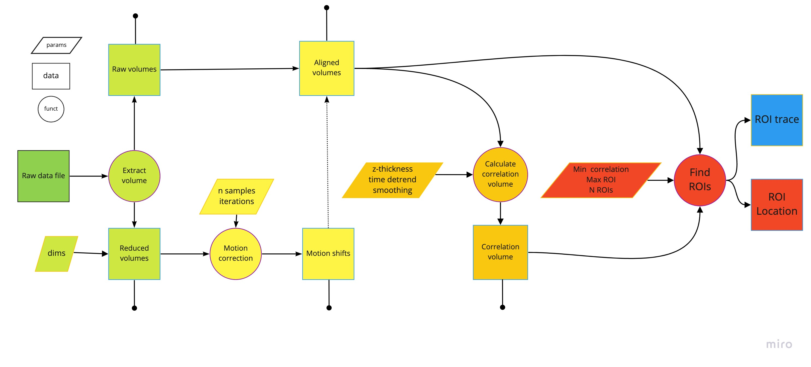

# NPP
Neural Preprocessing Pipeline (NPP) extracts ROI fluorescent traces from raw byte stream dat files

Works specifically with Swept, Confocally Aligned Planar Excitation (SCAPE) microscope. Toolbox converts raw `.dat` files into a single aggregated, compressed data file. Then applies rigid motion correction to chunks, neural cluster and spike extract from 4D SCAPE data.

# Data structure
```
.
└── 20210531
    ├── Fish1
    │   ├── 20210531_6dpf_HUC_H2B_fish1_run1
    │   └── tiff_stacks
    │       └── 20210531_6dpf_HUC_H2B_fish1_run1
    │           ├── aligned_volumes
    │           │   ├── 000001.mat
    │           │   ├── 000002.mat
    │           │   └── ...
    │           ├── data.mat
    │           ├── dataSkewCorrected.mat
    │           ├── datanoSC.mat
    │           ├── motion_correction_shifts
    │           │   ├── 0_motion_shifts.csv
    │           │   ├── 1_motion_shifts.csv
    │           │   └── 2_motion_shifts.csv
    │           ├── reduced_volumes
    │           │   ├── 000001.mat
    │           │   ├── 000002.mat
    │           │   └── ...
    │           ├── roi
    │           │   ├── all_rois.npy
    │           │   ├── all_traces.npy
    │           │   ├── correlation_volume.npy
    │           │   └── used_pixels.npy
    │           ├── single_volumes
    │           │   ├── 000001.mat
    │           │   ├── 000002.mat
    │           │   └── ...
    │           └── visualisation
    │               ├── example.mp4
    │               └── png_dump
    │                   ├── 00001.png
    │                   ├── 00002.png
    │                   └── ...
    ├── Fish2
    └── ...
```

# Repo structure
```ruby
.
├── LICENSE
├── README.md
├── requirements.txt
├── src
│   ├── correlation_map.py
│   ├── deskew_volume.py
│   ├── readme.md
│   ├── rigid_motion_correction.py
│   ├── roi_extraction.py
│   ├── tracking_behaviour.py
│   └── volume_reduction.py
├── tests
│   └── test-motion-correction.ipynb
├── tutorials
│   ├── tutorial-0-volume-reduction.ipynb
│   ├── tutorial-1-motion-correction.ipynb
│   ├── tutorial-2-volume-transformation.ipynb
│   └── tutorial-3-correlation-map.ipynb
├── utils
│   ├── hdf5_tools.py
│   ├── io_functs.py
│   └── reshaping_visualisation_functs.py
└── visualisation
    ├── axial_projection_plot.py
    ├── depth_projection.py
    ├── subslice_mip_prjoection.py
    └── video_plots.py
```

# Terminology

`volume`: 3D array where axes are ordered (`z`, `y`, `x`)

`frame`: 3D array where axes are ordered (`z`, `y`, `x`)

`frames`: 4D array, where axes are ordered (`t`, `z`, `y`, `x`)

`timeseries`: 4D array, where axes are ordered (`t`, `z`, `y`, `x`)

`sub_stack`: 5D array, if the sub-stack was formed on the `axis=1`, i.e. z axis, with a `frames` array, the ordering of 
the sub-stack would follow (`t`, `y`, `x`, `z`, `dz`).

`n_timesteps`: number of timesteps wish to use

`filename`: normally refering to a volume, which wil follow format `f"{i:06}"` i.e. a integer value padded with 6 
digits.

`parent_dir`: str pointing to the directory containing the raw data file e.g. `"tiff_stacks/20210531_6dpf_HUC_H2B_fish1_run1"`

`path_dir`: str pointing to the directory containing the raw data file e.g. `"tiff_stacks/20210531_6dpf_HUC_H2B_fish1_run1/aligned_volumes"`

`export_dir`: str pointing to the directory where files want to be saved

## General TODO
* Go through project and ensure variables are consistently labelled.

# Work flow


Schematic of the SCAPE toolbox pipeline.

## 1. Volume extraction

Read in the orginal `data.mat` file and export the single file into individual volumes labelled by the time step e.g.
*volume 1: "00001.mat", volume 2: "00002.mat", etc.*.

Depending of the volume and level of compression each volume can range between 10-15Mb, which is a lot is an experiment 
has recorded > 6000 volumes. A reduced volume is also extracted which is used for other preprocessing computations e.g.,
motion correction,  background removal, and identifying optovin/null volumes. `dim` coordinate parameters are require to
specify the reduced region of interest (follows the covention of np arrays `[z1, z2, y1, y2, x1, x2]`).

### Main Functions:
``` python
export_to_single_volumes(filepath=path_dir + file_name, volume_labels=labels, 
                         export_path=reduced_export_path, reduced_dims=dims)
```

### TODO:
Find a method to execute matlab code through python to centralise this pipeline (only this step).


> **_NOTE:_**  Currently unable to directly read in the raw data `.mat` file as the temporal order is lost. This might 
> be to do with the high compression of the version 7.3. `.mat` files. Structure is not degraded when accessing on 
> matlab code.

## 2. Motion Correction

Iteratively apply rigid motion correction to the reduced volumes in order to find the z, y, x shifts for each volume.
This uses a template volume to compare each volume with. A template volume is created from the mean of n random samples.
Relative volume shifts are calculated using [phase cross correlation](https://scikit-image.org/docs/0.13.x/auto_examples/transform/plot_register_translation.html).
This returns the subpixel shift values for each volume w.r.t. to the latest reference. The shifts will be stored as a 
`.csv` file and the number will correspond the number of remaining iterations i.e., the last shift update will be 
labelled `0_motion_correction.csv`, attached to the last column will be the absolute shift.

This process is repeated, but the latest [shifts](https://docs.scipy.org/doc/scipy/reference/generated/scipy.ndimage.shift.html)
will be applied only to a newly sampled set of volumes to make an updated template. The updated template will compared 
to the original volumes and new phase shift values will be calculated.

This repeated process is dependent on the number of predefine iterations (default is set as 3).

With the final shifts calculates this can then be applied to each volume, and so you can save the updated, motion 
corrected volumes.

> **_NOTE:_** All corrupt volumes are excluded from this process and are not included in any of the motionc correction 
> process. An example of  a corrupt volume would be one during the optovin flash.

> **_NOTE:_** Calculating the phase shifts and applying the 3d subpixel shifts is computationally heavy.
> The code has been optimised with [ray](https://docs.ray.io/en/latest/starting-ray.html) to parrelize
> when possible. However, it is most efficient with smaller volumes, timesteps, and template samples.

### Main functions
```python
import numpy as np
from src.rigid_motion_correction import MotionCorrection

timeseries = []
# remove optovin flashes
corrupt_frames = np.unique(np.where(np.mean(timeseries, axis=(1, 2)) > 116)[0])
if corrupt_frames.size != 0:
    timeseries = np.delete(timeseries, corrupt_frames)

# get motion shift
motion_corrected = MotionCorrection(frames=timeseries, n_max_recursions=3, n_samples=20,
                                    log_filepath=f"{path_dir}/../")
# apply aligment and save shifts
motion_corrected.rigid_alignment()
```

## 3. Correlation atlas
Produce a correlation map for each slice in the volume. The data is 3D so correlation amongst neighbouring pixels factor
across the plane. To optimise this we define a limit in the z-plane, esentially looking for correlation in a sub-stack.
This is achieved by adding a new dimension and rolling through a [predefined thickness](https://numpy.org/devdocs/reference/generated/numpy.lib.stride_tricks.sliding_window_view.html).

Method to find a correlation map can be found in [this](https://www.biorxiv.org/content/10.1101/061507v2.full) reference.
Each, voxel correlation can be determined by
```
$`c(f_{1}, f_{2}, ...) =  \frac{||\sum_{i} x_{i} ||^2}{N\sum_{i}|| x_{i} ||^2}`$

```

The substack is centered, then a copy substack is Gaussian smoothed in the z, y, x dimensions. The copy is frobenius 
normalised along the time dimension then squared (forming the numerator in the equation above). The original array is 
first normalised then filtered over time and squared (making the denominator in the equation).

Taking the middle for each correlation substack corresponds to the volume sub-stack. 

> **_NOTE:_** There is also a time drift filter - mexican hat to prevent long timescale drift inference with the short-term 
> correlation values.

### Main function
```python
import ray
import numpy as np
from src.correlation_map import define_sliding_z_thickness, apply_motion_correction, compute_correlation_map
# load data
timeseries = apply_motion_correction()
# add new roll axis dimension
sub_stacks = define_sliding_z_thickness(timeseries, z_thickness=5, axis=1)
n_windows = sub_stacks.shape[-2]

del timeseries

# parallelize function
corr_map_ids = [compute_correlation_map.remote(sub_stacks[:, :, :, dz_ix, :], 1, 40) for dz_ix in range(n_windows)]
# get data from pointed memory
correlation_vol = np.array(ray.get(corr_map_ids)).transpose(1, 2, 0)
```

## 4. ROI extraction
Identify the pixel in the correlation volume with the highest correlation value to seed the ROI map. Take the indices of
the nearest neighbour by [dilating](https://scikit-image.org/docs/dev/api/skimage.morphology.html#skimage.morphology.binary_dilation)
a [cube of interest](https://scikit-image.org/docs/dev/api/skimage.morphology.html#skimage.morphology.cube) *(a ball 
could also be used)*.

Pull out the fluorescent traces of the nearest neighbours and compute the timeseries pearson rank correlation to that 
of the ROI. If the correlation exceeds the predefined correlation threshold, add the traces together as a new ROI and 
continue to dilate the ROI.

This process will continue until the maximum ROI pixel size is met or if there are no neighbouring pixels exceeding the
correlation threshold.

After this process, mask the ROI pixel values as 0 then find a correlation pixel as a new seed in the process. Continue
until you have reach N ROI, or no more high-correlation pixels.


### TODO:
Refactor functions and parallelise.

## 5. ∂f/f0 trace extraction
Minus the rolling average along each pixel timeseries

# Visualisation scripts

